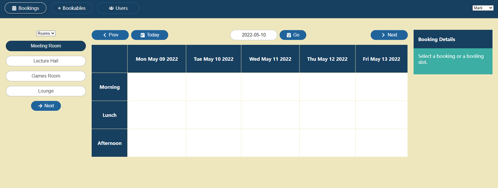
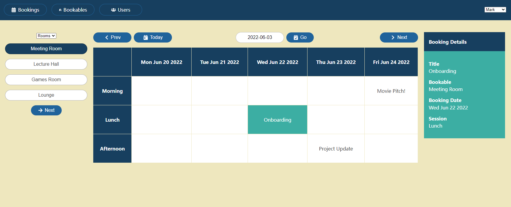
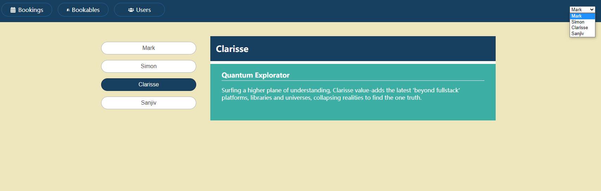
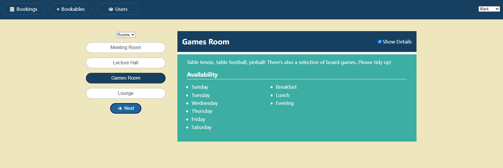

# A Booking website using React hooks

This is a booking website for a company's internal booking management. It is a practice project for the book _React Hooks in Action_ by JOHN LARSEN.

## Table of contents

- [A Booking website using React hooks](#a-booking-website-using-react-hooks)
  - [Table of contents](#table-of-contents)
  - [Overview](#overview)
    - [Requirements](#requirements)
    - [Screenshot](#screenshot)
    - [Links](#links)
  - [My process](#my-process)
    - [Built with](#built-with)
    - [What I learned](#what-i-learned)
    - [Continued development](#continued-development)
    - [Useful resources](#useful-resources)
  - [Author](#author)
  - [Acknowledgments](#acknowledgments)

## Overview

### Requirements

The entire application is divided into four categrouies of components: Bookables, Bookings, Users and UI

- The App component is the root component for the application. It displays the header with its links and user-picker drop-down
- The App component also sets up routes to the three main pages, Bookings, Bookables and Users.
- The BookablesPage component is the parent of all other Bookables components.
- The BookablesView component manages the state of which bookable is currently selected using `useState ` hook and pass down the state along with the update function to its children.
- The BookablesList component display a list of all available facilities to book with a dropdown list and a "Next" button for stepping through all the bookables.
- The BookingsPage component is the parent of all other Bookings components.
- The BookingsPage component manages the state of which bookable is currently selected using `useState ` hook and pass down the state along with the update function to its children.
- The BookablesList component is reused for the same purpose as before.
- The Bookings component contains the WeekPicker component which is for users to choose a range of date and the BookingsGrid component.
- The BookingsGrid component generates a date-seesion table for the selected bookable calling the grid-builder function.

### Screenshot






### Links

- Live Site: [Booking-site](https://haolzz.github.io/Booking/)

## My process

### Built with

- CSS custom properties
- CSS Flexbox and Grid for layout
- React hooks for React component state management
- [React](https://reactjs.org/) - JS library
- [Create React App](https://create-react-app.dev/) - CRA for React build setup
- [My JSON Server](https://my-json-server.typicode.com/) - Mock API for serving JSON data

### What I learned

1. Functionality that could be shared means we can extarct it into a custom hook. In this example code below, the data fetching function is encapsulated within a custom hook called `useFetch`.

   ```js
   import { useState, useEffect } from 'react';
   import { getData } from './api';
   export default function useFetch(url) {
     const [data, setData] = useState();
     const [error, setError] = useState(null);
     const [status, setStatus] = useState('idle');
     useEffect(() => {
       let doUpdate = true;

       setStatus('loading');
       setData(undefined);
       setError(null);

       getData(url)
         .then((data) => {
           if (doUpdate) {
             setData(data);
             setStatus('success');
           }
         })
         .catch((error) => {
           if (doUpdate) {
             setStatus('error');
             setError(error);
           }
         });

       return () => (doUpdate = false);
     }, [url]);
     return { data, status, error };
   }
   ```

2. Before rerunning an effect, React calls any associated cleanup function for the previous invocation of the effect, in this case the cleanup function`return () => (doUpdate = false)` makes the in-flight data invalid.

   ```js
   useEffect(() => {
     let doUpdate = true;

     setStatus('loading');
     setData(undefined);
     setError(null);

     getData(url)
       .then((data) => {
         if (doUpdate) {
           setData(data);
           setStatus('success');
         }
       })
       .catch((error) => {
         if (doUpdate) {
           setStatus('error');
           setError(error);
         }
       });

     return () => (doUpdate = false);
   }, [url]);
   ```

### Continued development

- Rewrite with TypeScript
- Beautify website using Material-UI

### Useful resources

- [React hooks](https://reactjs.org/docs/hooks-intro.html) - React offical tutorial for hooks.
- [How to call an async function inside a UseEffect() in React](https://stackoverflow.com/questions/56838392/how-to-call-an-async-function-inside-a-useeffect-in-react) - A helpful explaination about async function inside useEffect hook.

## Author

- GitHub - [Haoliang Zhang](https://github.com/HaoLZz)
- LinkedIn - [Haoliang Zhang](https://www.linkedin.com/in/haoliangzhangengineer/)

## Acknowledgments

```

```
